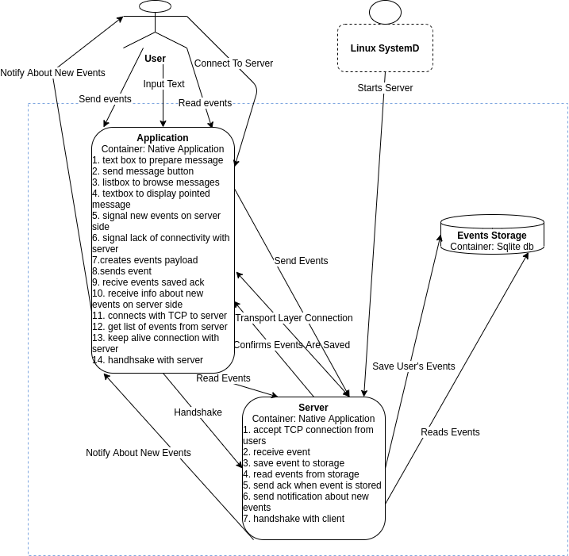
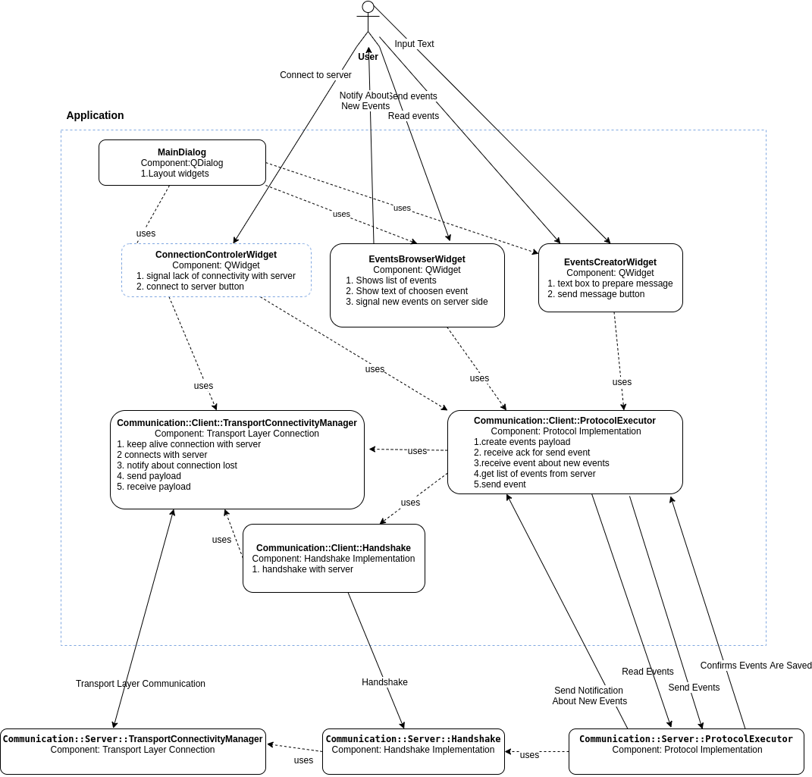
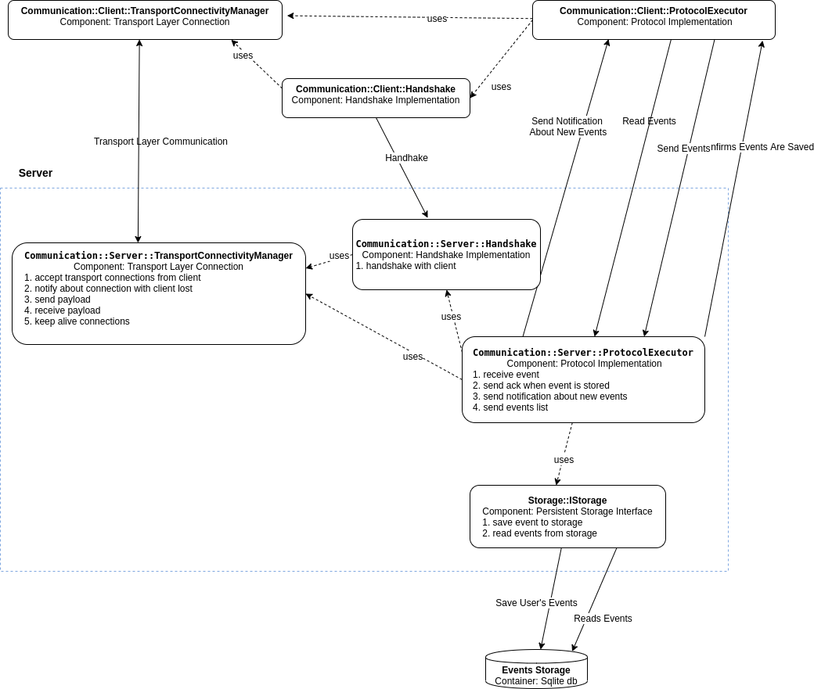
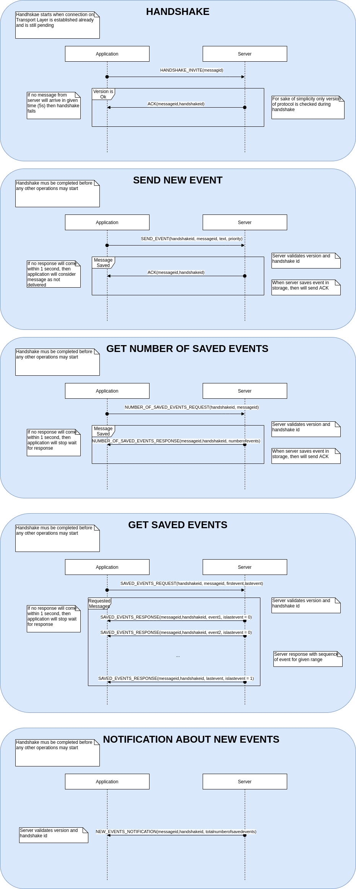

# Requirements
1. REQ_0001 Use C++
2. REQ_0002 Platform Linux
3. REQ_0003 Communication between client and server with TCP/IP
4. REQ_0004 Define Application layer protocol
5. REQ_0005 Server works as a system service
6. REQ_0006 GUI with Qt
7. REQ_0007 Each event must have: timestamp, priority, text
8. REQ_0008 Event can be only created by connected clients
9. REQ_0009 User can create Event with gui
10. REQ_0010 User can browse events on server
12. REQ_0011 Server saves received events into database
13. REQ_0012 Separated library to communication client/server
14. REQ_0013 Server notifies clients about new events
15. REQ_0014 User sends events to server
16. REQ_0015 Document interfaces with Doxygen

# Architecture drivers
1. Deliver MPV as fast as possible (I have no much time to implement this)
2. Stay open for system extensions (add security, AAA, etc... because it was mentioned in the challenge's description)
3. Use C++
4. Do not use not portable C++ libraries
5. CMake as a build system (because of driver 1)
6. C4 documentation for system architecture
7. Automatic tests with unit test (gtest and gmock)

# System documentation
System is simple, so I decided to do not include C1 (system level) diagram
## C2 System containers diagram

### C3 Application components diagram

### C3 Server components diagram

## Application Protocol
### Messages format ( as frames of bits )
#### Common Header
|     16b |    16b |
|--------:|-------:|
| Length | Version |

Header shape is decisive for all further versions of protocol - every protocol packet
shall start with the header. It contains version number and total packet length (includes the header)
#### Protocol Version 1
##### Header
Each message in version 1 started with this header
|     32b |    8b |
|--------:|-------:|
| Common Header | Message Type |

Message Types:
* 0 = HANDSHAKE_INVITE
* 1 = ACK
* 2 = SEND_EVENT
* 3 = NUMBER_OF_SAVED_EVENTS_REQUEST
* 4 = NUMBER_OF_SAVED_EVENTS_RESPONSE
* 5 = SAVED_EVENTS_REQUEST
* 6 = SAVED_EVENTS_RESPONSE
* 7 = NEW_EVENTS_NOTIFICATION
##### HANDSHAKE_INVITE
|     32b |    8b |    32b |
|--------:|-------:|-------:|
| Common Header | 0 | Client Message Id|
* **Client Message Id** is generated by te client
##### ACK
|     32b |    8b |    32b |    32b |
|--------:|-------:|-------:|-------:|
| Common Header | 1 | Handshake Id | Client Message Id|
* **Handshake Id** id of completed handshake 
* **Client Message Id** message id of a client request
##### SEND_EVENT
|     32b |    8b |    32b |    32b |    32b |    16b | ....|
|--------:|--------:|-------:|-------:|-------:|-------:|-------:|
| Common Header | 2 | Client Message Id| Handshake Id| Priority| Length of text| Text|
* **Client Message Id** is generated by te client
* **Handshake Id** id of completed handshake
* **Priority** priority of event
* **Length of text** length of and event's text
* **Text** number of bytes with an event's text
##### NUMBER_OF_SAVED_EVENTS_REQUEST
|     32b |    8b |    32b |    32b |
|--------:|-------:|-------:|-------:|
| Common Header | 3 | Client Message Id | Handshake Id|
* **Client Message Id** is generated by te client
* **Handshake Id** id of completed handshake
##### NUMBER_OF_SAVED_EVENTS_RESPONSE
|     32b |    8b |    32b |    32b |    64b |
|--------:|-------:|-------:|-------:|-------:|
| Common Header | 4 | Handshake Id | Client Message Id| Number of events|
* **Handshake Id** id of completed handshake 
* **Client Message Id** message id of a client request
* **Number of events**  number of saved events
##### SAVED_EVENTS_REQUEST
|     32b |    8b |    32b |    32b |    64b |    64b |
|--------:|-------:|-------:|-------:|-------:|-------:
| Common Header | 5 | Client Message Id | Handshake Id| First Message Nr| Last Message Nr|
* **Client Message Id** is generated by te client
* **Handshake Id** id of completed handshake
* **First Message Nr** first message number in the requested events range
* **Last Message Nr** last message number in the requested events range
##### SAVED_EVENTS_RESPONSE
|     32b |    8b |    32b |    32b |    8b |    32b |    32b | uint16_t| .... |
|--------:|-------:|-------:|-------:|-------:|-------:|-------:|-------:|-------:|
| Common Header | 6 | Handshake Id | Client Message Id| Is Last event| Timestamp| Priority| Length Of Text | Text |
* **Client Message Id** is generated by te client
* **Handshake Id** id of completed handshake
* **Timestamp** number of millisecond from the epoch
* **Priority** priority of event
* **Length of text** length of and event's text
* **Text** number of bytes with an event's text
##### NEW_EVENTS_NOTIFICATION
|     32b |    8b |    32b |    64b |
|--------:|-------:|-------:|-------:|
| Common Header | 7 | Handshake Id |  Number of events|
* **Handshake Id** id of completed handshake 
* **Number of events**  number of saved events
### Messages Interactions

# Build system
## Structure of project directories

- **doc** directory with documentation
- **include** directory with include files shared between project's items
- **src** directory with projects items implementation
- **test** directory with unit tests
  - **Mock** folder for mock-up's
  - **googletest** git submodule with gtest/gmock
 

## Build
### Requirement
* Program was compiled and tested on Linux 16.04.1-Ubuntu and Ubuntu 18.04.3 LTS
* gcc version 7.3.0 (Ubuntu 7.3.0-16ubuntu3~16.04.1) and 7.5.0 (Ubuntu 7.5.0-3ubuntu1~18.04)
* If you would like to use other compilers: C++17 support is obligatory
* Qt version 5.5.1 and 5.9.5
* sqlite 2.8.17

### Procedure
1. cd <path_to_sources_root>
2. git submodule init
3. git submodule update
4. cd <path_to_build_output>
5. cmake <path_to_sources_root>
6. make
7. ctest -V -R Unit.

## Installation
After build procedure
1. cd <path_to_build_output>
2. sudo make install
3. sudo systemctl daemon-reload
4. sudo systemctl start ChallengeServer

At this moment server should be started and works as a system daemon.
Executable binaries are copied to /usr/loclal/bin
Shared libraries are copied to /usr/lib

To start gui application just execute 'challenge.application' in gui shell terminal

## Uninstall
After build procedure
1. cd <path_to_build_output>
2. sudo systemctl stop ChallengeServer
3. sudo make uninstall
4. sudo systemctl daemon-reload

# Possible extensions
The project was designed in modular fashion. Communications transport and application layers are separated and connects each other with abstract interfaces. Handshake mechanism is also separated by abstract interfaces. It means that it is possible to implement complicated handshake mechanism ( with authentication and authorization ) without changes in the rest of communication libraries. Similar situation is with EventsStorage, which is now implemented on SQLLite, but it can be easy changed to any other kind storage without affects rest of design. To save time for development this small project I resigned from configuration of server addresses, ports etc. (all this are hardcoded in include/Configuration/Defines.h), but system may be extended for configurator. 

# Unresolved problems
1. Lack of 'NOK' message when SendNewEvent may cause situation when event will be saved
but client may consider it as not saved
2. Lack of 'no messages' answer for SavedEventsRequest force application to wait 1s in case
when no events are saved on server site  
